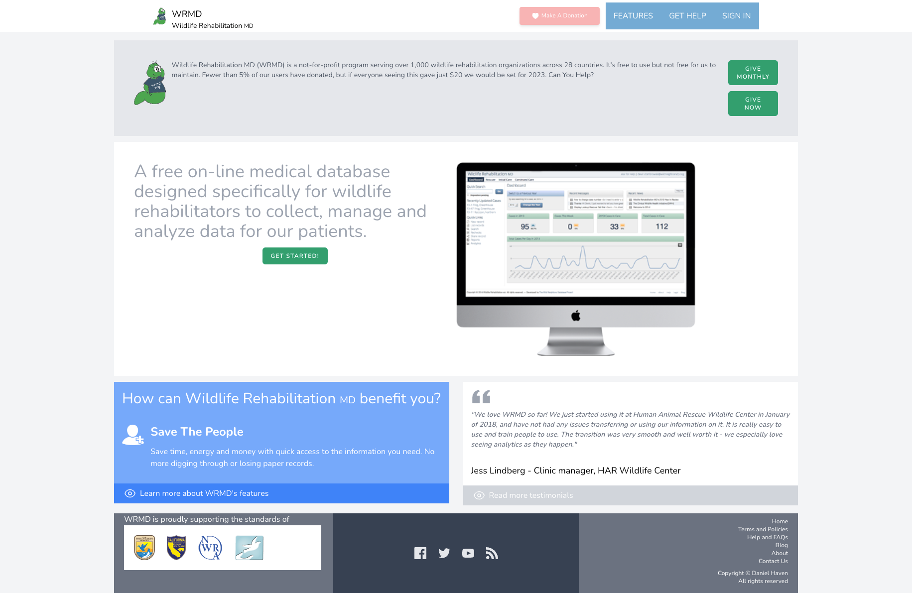
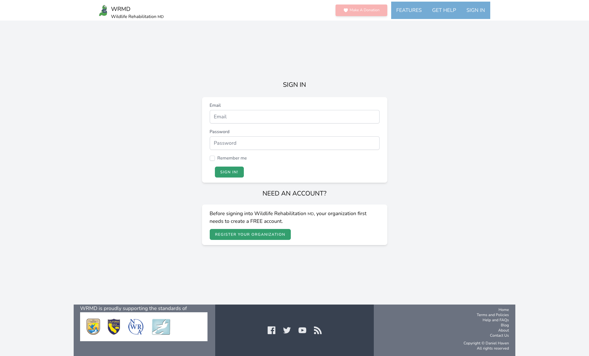

# WRMD Remake Demo

This is a remake demo of wrmd.org.

## How To Use

You need the following to run effectively:

1. Docker
2. PHP 8 or Later

Clone the repository and run the following command in the root: `./vendor/bin/sail up`.

**Note**: Testing commands like `./vendor/bin/sail artisan test` will not run successfully unless the `./vendor/bin/sail up` is running.

## Screenshots

### Full Screen

### iPhone SE

.png)

_Drawer%20Open.png)

